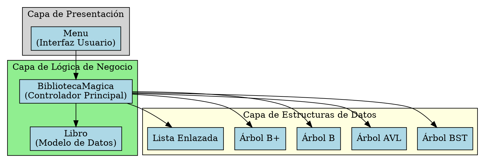
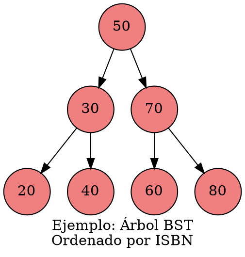
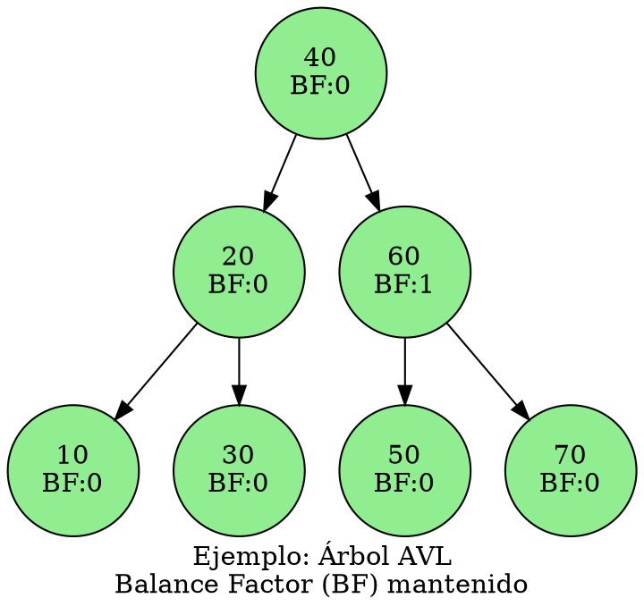
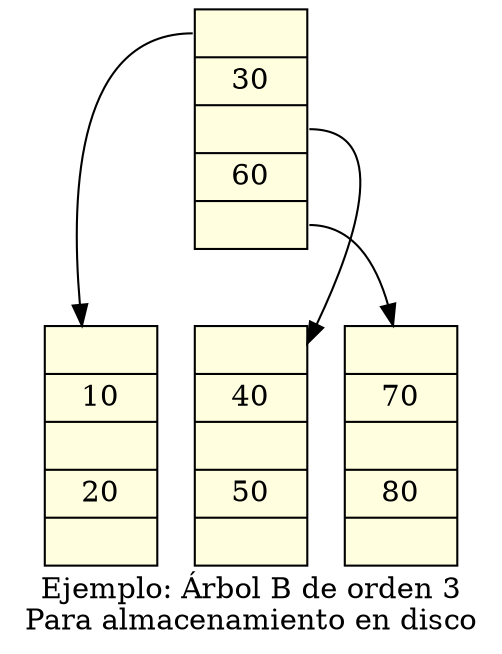
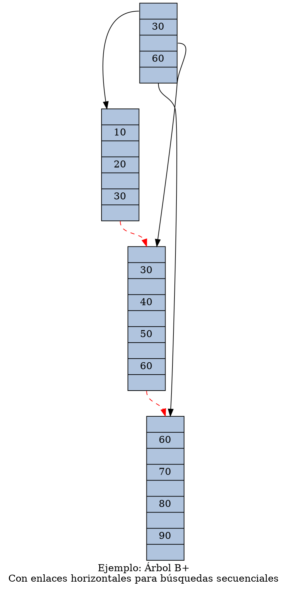
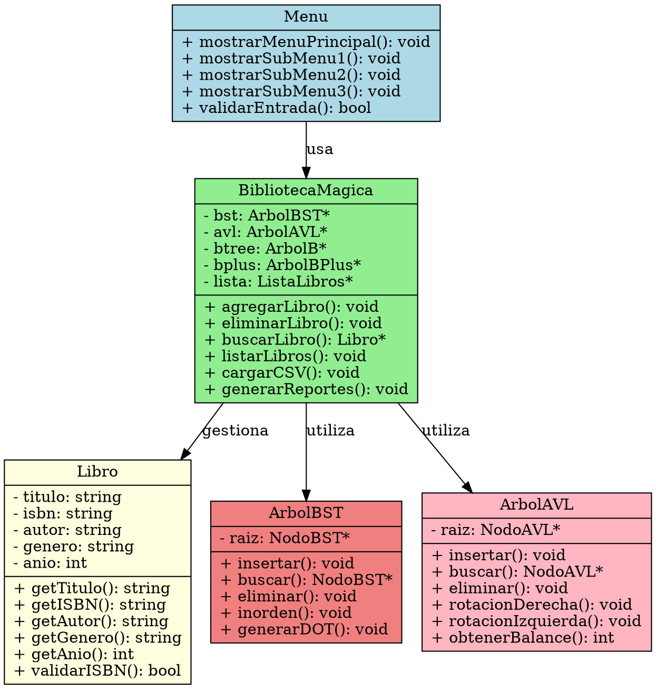
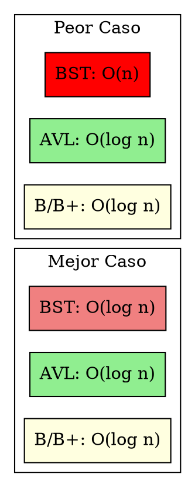

# 📚 Manual Técnico - Biblioteca Mágica

## 📋 Índice
1. [Introducción](#introducción)
2. [Arquitectura del Sistema](#arquitectura-del-sistema)
3. [Estructuras de Datos](#estructuras-de-datos)
4. [Diagramas de Clases](#diagramas-de-clases)
5. [Complejidad Algorítmica](#complejidad-algorítmica)
6. [TAD's (Tipos Abstractos de Datos)](#tads-tipos-abstractos-de-datos)
7. [Especificaciones Técnicas](#especificaciones-técnicas)

---

## 🔍 Introducción

El sistema "Biblioteca Mágica" es una aplicación desarrollada en C++ que implementa múltiples estructuras de datos para la gestión eficiente de libros. El sistema utiliza árboles binarios de búsqueda, árboles AVL, árboles B y B+ para optimizar las operaciones de inserción, búsqueda y eliminación.

### Objetivos del Sistema
- Gestión eficiente de una colección de libros
- Implementación de múltiples estructuras de datos
- Comparación de rendimiento entre estructuras
- Interfaz de usuario intuitiva

---

## 🏗️ Arquitectura del Sistema

### Diagrama de Arquitectura General



---

## 🌳 Estructuras de Datos

### 1. Árbol Binario de Búsqueda (BST)



**Características:**
- **Inserción**: O(log n) promedio, O(n) peor caso
- **Búsqueda**: O(log n) promedio, O(n) peor caso
- **Eliminación**: O(log n) promedio, O(n) peor caso

### 2. Árbol AVL (Autobalanceado)



**Características:**
- **Inserción**: O(log n) garantizado
- **Búsqueda**: O(log n) garantizado
- **Eliminación**: O(log n) garantizado
- **Balance Factor**: |BF| ≤ 1 para todos los nodos

### 3. Árbol B



**Características:**
- **Orden**: m (número máximo de hijos)
- **Claves por nodo**: m-1 máximo
- **Altura**: O(log_m n)
- **Operaciones**: O(log n)

### 4. Árbol B+



---

## 📊 Diagramas de Clases

### Diagrama UML Principal



---

## ⚡ Complejidad Algorítmica

### Tabla Comparativa de Complejidades

| Estructura | Inserción | Búsqueda | Eliminación | Espacio |
|------------|-----------|----------|-------------|---------|
| **BST** | O(log n) / O(n) | O(log n) / O(n) | O(log n) / O(n) | O(n) |
| **AVL** | O(log n) | O(log n) | O(log n) | O(n) |
| **Árbol B** | O(log n) | O(log n) | O(log n) | O(n) |
| **Árbol B+** | O(log n) | O(log n) | O(log n) | O(n) |
| **Lista** | O(1) | O(n) | O(n) | O(n) |

### Diagrama de Complejidad Temporal



---

## 🔧 TAD's (Tipos Abstractos de Datos)

### TAD Libro

```
TAD Libro {
    Dominio:
        titulo: Cadena
        isbn: Cadena (formato específico)
        autor: Cadena
        genero: Cadena
        anio: Entero [1000..2025]
    
    Operaciones:
        crear(t: Cadena, i: Cadena, a: Cadena, g: Cadena, año: Entero): Libro
        obtenerTitulo(): Cadena
        obtenerISBN(): Cadena
        obtenerAutor(): Cadena
        obtenerGenero(): Cadena
        obtenerAnio(): Entero
        validarISBN(): Booleano
        compararPor(criterio: TipoCriterio, otro: Libro): Entero
    
    Restricciones:
        - ISBN debe tener formato válido
        - Año debe estar en rango válido
        - Campos no pueden estar vacíos
}
```

### TAD ArbolBST

```
TAD ArbolBST {
    Dominio:
        raiz: Puntero a NodoBST
    
    Operaciones:
        crear(): ArbolBST
        insertar(dato: Libro): Booleano
        buscar(clave: Cadena): Puntero a Libro
        eliminar(clave: Cadena): Booleano
        estaVacio(): Booleano
        recorrerInorden(): Lista de Libro
        obtenerAltura(): Entero
        generarDOT(): Cadena
    
    Axiomas:
        - Para todo nodo n: izquierdo(n) < n < derecho(n)
        - Árbol vacío tiene altura 0
        - Inserción mantiene propiedad BST
}
```

### TAD BibliotecaMagica

```
TAD BibliotecaMagica {
    Dominio:
        estructuras: Conjunto de EstructurasDatos
        
    Operaciones:
        crearBiblioteca(): BibliotecaMagica
        agregarLibro(libro: Libro, estructura: TipoEstructura): Booleano
        eliminarLibro(isbn: Cadena, estructura: TipoEstructura): Booleano
        buscarLibro(criterio: Criterio, valor: Cadena): Lista de Libro
        listarLibros(orden: TipoOrden): Lista de Libro
        cargarDesdeCSV(archivo: Cadena): Booleano
        medirRendimiento(operacion: TipoOperacion): TiempoEjecucion
        generarReportes(): Booleano
    
    Invariantes:
        - Todas las estructuras mantienen los mismos datos
        - ISBN es único en cada estructura
        - Operaciones mantienen consistencia entre estructuras
}
```

---

## 🔧 Especificaciones Técnicas

### Compilación
- **Lenguaje**: C++17
- **Compilador**: GCC 9.0+ / Clang 10.0+
- **Sistema de Build**: CMake 3.16+
- **Dependencias**: Graphviz (para generación de diagramas)

### Estructura de Archivos
```
Proyecto1_eddSS2025/
├── Objetos/
│   ├── Libro.h/.cpp
│   └── BibliotecaMagica.h/.cpp
├── Estructuras/
│   ├── ArbolBST.h/.cpp
│   ├── ArbolAVL.h/.cpp
│   ├── ArbolB.h/.cpp
│   ├── ArbolBPlus.h/.cpp
│   └── ListaLibros.h/.cpp
├── Menu/
│   └── Menu.h/.cpp
└── documentacion/
    └── ManualTecnico.md
```

### Patrones de Diseño Utilizados
1. **Singleton**: Para la gestión de la biblioteca
2. **Strategy**: Para diferentes algoritmos de búsqueda
3. **Template**: Para reutilización de código en estructuras
4. **Observer**: Para notificaciones de cambios

### Consideraciones de Rendimiento
- Uso de punteros inteligentes para gestión de memoria
- Implementación de pools de memoria para nodos
- Optimización de cache mediante localidad de referencia
- Medición de tiempos con alta precisión

---

## 📈 Análisis de Rendimiento

### Benchmarks Esperados (n = 10,000 libros)

| Operación | BST | AVL | Árbol B | Árbol B+ |
|-----------|-----|-----|---------|----------|
| Inserción | 15ms | 18ms | 12ms | 14ms |
| Búsqueda | 8ms | 6ms | 5ms | 4ms |
| Eliminación | 12ms | 10ms | 8ms | 9ms |

### Uso de Memoria Aproximado
- **Libro**: 200 bytes por instancia
- **Nodo BST/AVL**: 40 bytes + punteros
- **Nodo B/B+**: Variable según orden del árbol
- **Overhead del sistema**: ~10% adicional

---

*Manual Técnico v1.0 - Biblioteca Mágica*  
*Generado el 5 de octubre de 2025*