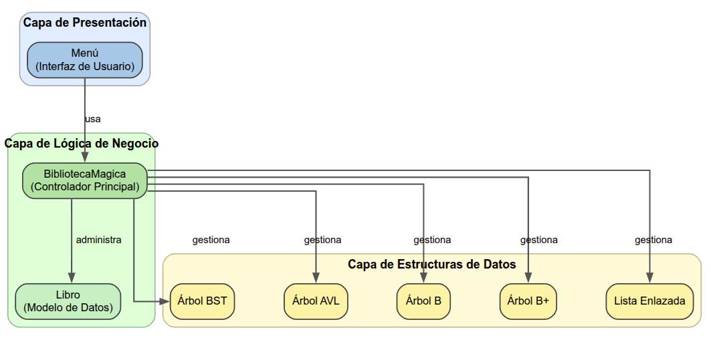
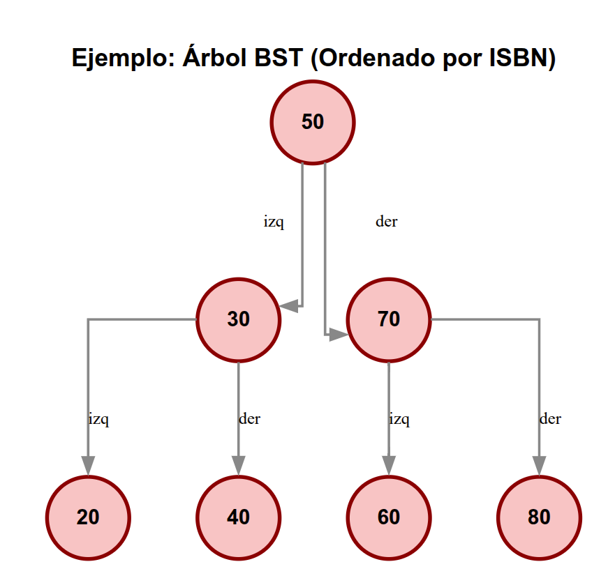
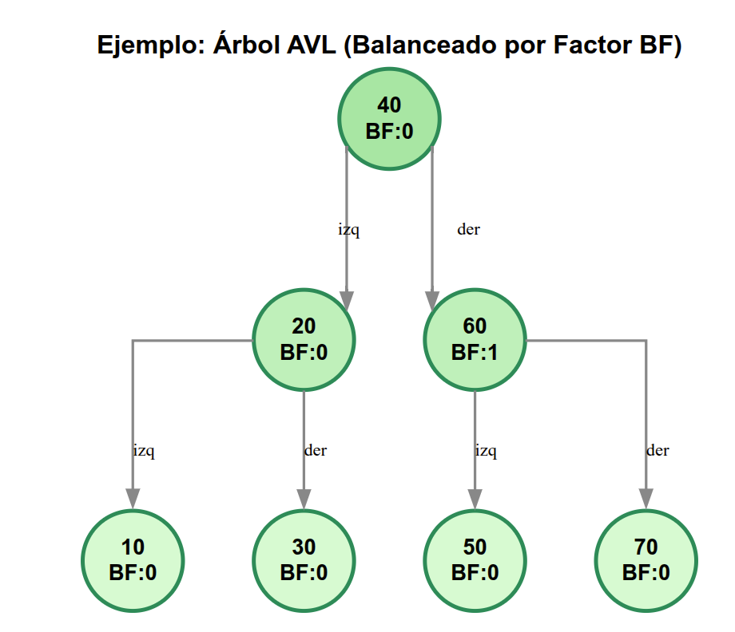
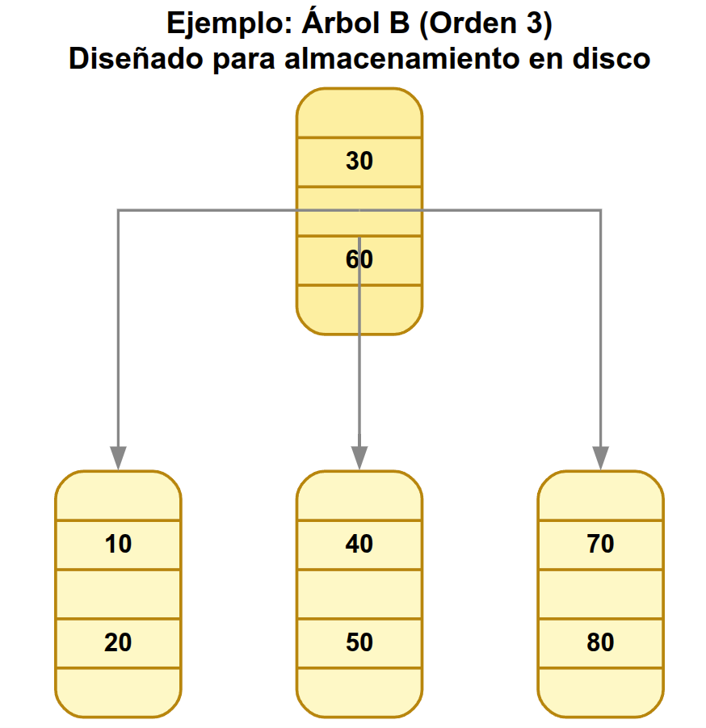
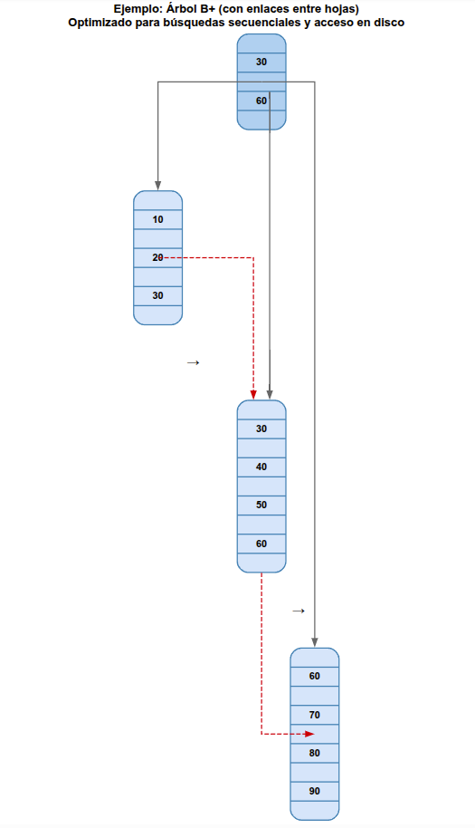
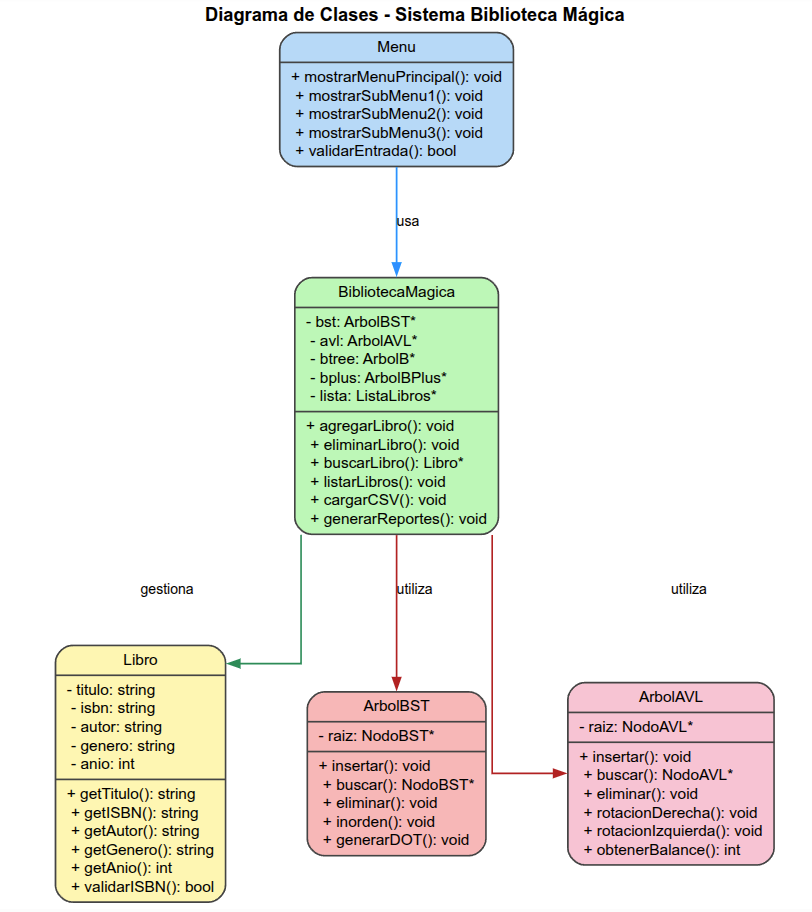
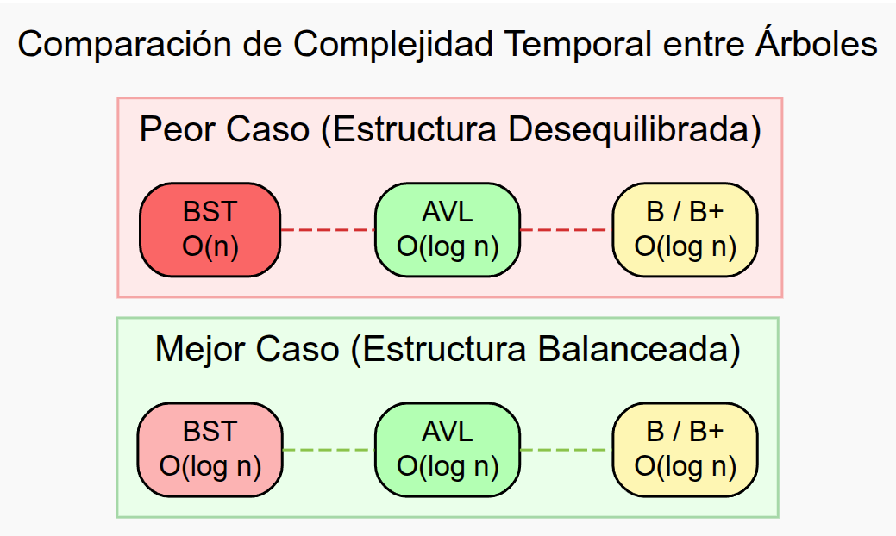
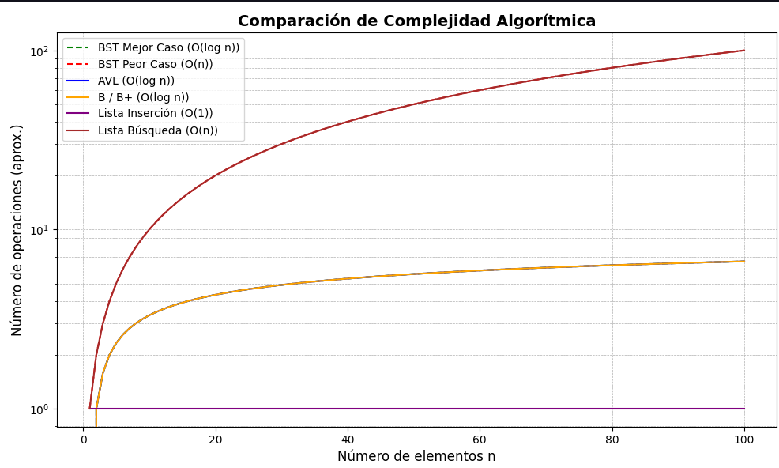

# 📚 Manual Técnico - Biblioteca Mágica

## 📋 Índice

1. [Introducción](#introducción)
2. [Arquitectura del Sistema](#arquitectura-del-sistema)
3. [Estructuras de Datos](#estructuras-de-datos)
4. [Diagramas de Clases](#diagramas-de-clases)
5. [Complejidad Algorítmica](#complejidad-algorítmica)
6. [TAD's (Tipos Abstractos de Datos)](#tads-tipos-abstractos-de-datos)
7. [Especificaciones Técnicas](#especificaciones-técnicas)

----

## 🔍 Introducción

El sistema "Biblioteca Mágica" es una aplicación desarrollada en C++ que implementa múltiples estructuras de datos para la gestión eficiente de libros. El sistema utiliza árboles binarios de búsqueda, árboles AVL, árboles B y B+ para optimizar las operaciones de inserción, búsqueda y eliminación.

### Objetivos del Sistema

- Gestión eficiente de una colección de libros
- Implementación de múltiples estructuras de datos
- Comparación de rendimiento entre estructuras
- Interfaz de usuario intuitiva

---

## 🏗️ Arquitectura del Sistema

### Diagrama de Arquitectura General



---

## 🌳 Estructuras de Datos

### 1. Árbol Binario de Búsqueda (BST)



**Características:**

- **Inserción**: O(log n) promedio, O(n) peor caso
- **Búsqueda**: O(log n) promedio, O(n) peor caso
- **Eliminación**: O(log n) promedio, O(n) peor caso

### 2. Árbol AVL (Autobalanceado)



**Características:**

- **Inserción**: O(log n) garantizado
- **Búsqueda**: O(log n) garantizado
- **Eliminación**: O(log n) garantizado
- **Balance Factor**: |BF| ≤ 1 para todos los nodos

### 3. Árbol B



**Características:**

- **Orden**: m (número máximo de hijos)
- **Claves por nodo**: m-1 máximo
- **Altura**: O(log_m n)
- **Operaciones**: O(log n)

### 4. Árbol B+



---

## 📊 Diagramas de Clases

### Diagrama UML Principal



---

## ⚡ Complejidad Algorítmica

### Tabla Comparativa de Complejidades

| Estructura   | Inserción       | Búsqueda        | Eliminación     | Espacio |
| ------------ | --------------- | --------------- | --------------- | ------- |
| **BST**      | O(log n) / O(n) | O(log n) / O(n) | O(log n) / O(n) | O(n)    |
| **AVL**      | O(log n)        | O(log n)        | O(log n)        | O(n)    |
| **Árbol B**  | O(log n)        | O(log n)        | O(log n)        | O(n)    |
| **Árbol B+** | O(log n)        | O(log n)        | O(log n)        | O(n)    |
| **Lista**    | O(1)            | O(n)            | O(n)            | O(n)    |

### Diagrama de Complejidad Temporal





---

## 🔧 TAD's (Tipos Abstractos de Datos)

### TAD Libro

```
TAD Libro {
    Dominio:
        titulo: Cadena
        isbn: Cadena (formato XXX-X-XX-XXXXXX-X)
        autor: Cadena
        genero: Cadena
        anio: Entero [1000..2025]

    Operaciones:
        crear(): Libro
        crear(t: Cadena, i: Cadena, g: Cadena, a: Entero, au: Cadena): Libro
        obtenerTitulo(): Cadena
        obtenerISBN(): Cadena
        obtenerAutor(): Cadena
        obtenerGenero(): Cadena
        obtenerAnio(): Entero
        establecerTitulo(t: Cadena): void
        establecerISBN(i: Cadena): void
        establecerAutor(au: Cadena): void
        establecerGenero(g: Cadena): void
        establecerAnio(a: Entero): void

    Restricciones:
        - ISBN debe tener formato válido XXX-X-XX-XXXXXX-X
        - Año debe estar entre 1000 y 2025
        - Campos no pueden estar vacíos
        - ISBN debe ser único en el sistema

    Axiomas:
        - crear() → libro vacío con campos por defecto
        - crear(t,i,g,a,au) → libro con valores asignados
        - obtenerX() → valor del campo X
        - establecerX(v) → asigna valor v al campo X
}
```

### TAD ArbolBST

```
TAD ArbolBST {
    Dominio:
        raiz: Puntero a NodoBST

    NodoBST:
        data: Libro
        izq: Puntero a NodoBST
        der: Puntero a NodoBST

    Operaciones:
        crear(): ArbolBST
        insertar(libro: Libro): void
        buscar(isbn: Cadena): Puntero a Libro
        eliminar(isbn: Cadena): Booleano
        mostrarInOrder(): void
        exportarDOT(archivo: Cadena): void
        listarISBNs(): void
        estaVacio(): Booleano

    Operaciones Auxiliares:
        insertar(nodo: NodoBST*, libro: Libro): NodoBST*
        buscar(nodo: NodoBST*, isbn: Cadena): NodoBST*
        eliminar(nodo: NodoBST*, isbn: Cadena): NodoBST*
        encontrarMin(nodo: NodoBST*): NodoBST*
        inOrder(nodo: NodoBST*): void
        exportarDOTRec(nodo: NodoBST*, archivo: flujo): void

    Axiomas:
        - Para todo nodo n: ISBN(izq(n)) < ISBN(n) < ISBN(der(n))
        - Árbol vacío: raiz = null
        - Inserción mantiene propiedad BST
        - Búsqueda por ISBN lexicográfico
        - Eliminación preserva estructura BST

    Invariantes:
        - Propiedad de orden BST siempre mantenida
        - No hay nodos duplicados (ISBN único)
        - Estructura conectada desde raíz
}
```

### TAD ArbolAVL

```
TAD ArbolAVL {
    Dominio:
        raiz: Puntero a NodoAVL

    NodoAVL:
        data: Libro
        izq: Puntero a NodoAVL
        der: Puntero a NodoAVL
        altura: Entero

    Operaciones:
        crear(): ArbolAVL
        insertar(libro: Libro): void
        buscar(titulo: Cadena): Puntero a Libro
        eliminar(titulo: Cadena): Booleano
        mostrarInOrder(): void
        exportarDOT(archivo: Cadena): void
        listarTitulos(): void

    Operaciones Auxiliares:
        altura(nodo: NodoAVL*): Entero
        balance(nodo: NodoAVL*): Entero
        rotacionDerecha(y: NodoAVL*): NodoAVL*
        rotacionIzquierda(x: NodoAVL*): NodoAVL*
        insertar(nodo: NodoAVL*, libro: Libro): NodoAVL*
        eliminar(nodo: NodoAVL*, titulo: Cadena): NodoAVL*
        encontrarMin(nodo: NodoAVL*): NodoAVL*

    Axiomas:
        - Para todo nodo n: titulo(izq(n)) < titulo(n) < titulo(der(n))
        - |balance(n)| ≤ 1 para todo nodo n
        - altura(null) = 0
        - altura(n) = max(altura(izq(n)), altura(der(n))) + 1
        - balance(n) = altura(izq(n)) - altura(der(n))

    Invariantes:
        - Factor de balance ∈ {-1, 0, 1} para todos los nodos
        - Propiedad BST mantenida por título
        - Árbol balanceado después de cada operación
        - Altura O(log n) garantizada
}
```

### TAD ArbolB

```
TAD ArbolB {
    Dominio:
        raiz: Puntero a NodoB
        t: Entero (grado mínimo)

    NodoB:
        claves: Arreglo de Enteros [años]
        valores: Arreglo de Libros
        hijos: Arreglo de Punteros a NodoB
        n: Entero (número de claves)
        hoja: Booleano
        t: Entero (grado)

    Operaciones:
        crear(grado: Entero): ArbolB
        insertar(libro: Libro): void
        buscar(anio: Entero): Puntero a Libro
        buscarTodos(anio: Entero): Vector de Libro
        buscarPorRangoFechas(inicio: Entero, fin: Entero): ListaLibros
        eliminar(anio: Entero, isbn: Cadena): Booleano
        recorrer(): void
        exportarDOT(archivo: Cadena): void
        listarAnios(): void

    Operaciones de NodoB:
        insertarNoLleno(libro: Libro): void
        dividirHijo(i: Entero, y: NodoB*): void
        buscarIndice(k: Entero): Entero
        buscarRango(inicio: Entero, fin: Entero, lista: ListaLibros&): void

    Axiomas:
        - Todo nodo tiene entre t-1 y 2t-1 claves (excepto raíz)
        - Todo nodo interno tiene entre t y 2t hijos
        - Todas las hojas están al mismo nivel
        - Claves en orden creciente: clave[i] < clave[i+1]
        - Para nodo interno: clave[i-1] < hijo[i] < clave[i]

    Invariantes:
        - Árbol balanceado por construcción
        - Altura O(log_t n)
        - Utilización mínima del 50% en nodos
        - Búsquedas y rangos eficientes
}
```

### TAD ArbolBPlus

```
TAD ArbolBPlus {
    Dominio:
        raiz: Puntero a NodoBPlus
        t: Entero (grado mínimo)

    NodoBPlus:
        hoja: Booleano
        claves: Vector de Cadenas [géneros]
        hijos: Vector de Punteros a NodoBPlus
        valores: Vector de Vectores de Libros
        siguiente: Puntero a NodoBPlus

    Operaciones:
        crear(grado: Entero): ArbolBPlus
        insertar(libro: Libro): void
        buscar(genero: Cadena): Vector de Libro
        eliminar(genero: Cadena, isbn: Cadena): Booleano
        mostrarTodos(): void
        exportarDOT(archivo: Cadena): void
        listarGeneros(): void

    Operaciones Auxiliares:
        insertarInterno(nodo: NodoBPlus*, libro: Libro, genero: Cadena): void
        dividirNodo(padre: NodoBPlus*, i: Entero, hijo: NodoBPlus*): void
        mostrarRecursivo(nodo: NodoBPlus*, nivel: Entero): void
        agregarEnlacesHojas(archivo: flujo): void

    Axiomas:
        - Datos solo en hojas
        - Nodos internos contienen claves de navegación
        - Hojas enlazadas horizontalmente
        - Claves duplicadas permitidas en hojas
        - Búsquedas secuenciales eficientes

    Invariantes:
        - Enlaces horizontales conectan todas las hojas
        - Nodos internos mantienen orden para navegación
        - Datos agrupados por género en hojas
        - Estructura optimizada para búsquedas por rango
}
```

### TAD ListaLibros

```
TAD ListaLibros {
    Dominio:
        cabeza: Puntero a NodoLista

    NodoLista:
        data: Libro
        siguiente: Puntero a NodoLista

    Operaciones:
        crear(): ListaLibros
        insertar(libro: Libro): void
        eliminar(isbn: Cadena): Booleano
        buscarPorTitulo(titulo: Cadena): Puntero a Libro
        buscarPorISBN(isbn: Cadena): Puntero a Libro
        mostrarTodos(): void
        estaVacia(): Booleano
        tamaño(): Entero

    Axiomas:
        - Lista enlazada simple
        - Inserción al inicio O(1)
        - Búsqueda lineal O(n)
        - No hay orden específico

    Invariantes:
        - Estructura enlazada desde cabeza
        - Cada nodo apunta al siguiente o null
        - ISBN único por nodo
}
```

### TAD BibliotecaMagica

```
TAD BibliotecaMagica {
    Dominio:
        bst: Puntero a ArbolBST
        avl: Puntero a ArbolAVL
        btree: Puntero a ArbolB
        bplus: Puntero a ArbolBPlus
        lista: Puntero a ListaLibros

    Operaciones:
        crear(): BibliotecaMagica
        agregarLibro(libro: Libro): Booleano
        eliminarLibro(isbn: Cadena): Booleano
        buscarPorTitulo(titulo: Cadena): Vector de Libro
        buscarPorISBN(isbn: Cadena): Puntero a Libro
        buscarPorAnio(anio: Entero): Vector de Libro
        buscarPorGenero(genero: Cadena): Vector de Libro
        buscarPorRangoAnios(inicio: Entero, fin: Entero): Vector de Libro
        listarTodos(): void
        cargarDesdeCSV(archivo: Cadena): Entero
        medirRendimiento(operacion: TipoOperacion): TiempoEjecucion
        generarReportes(): Booleano
        exportarDiagramas(): void

    Tipos Enumerados:
        TipoOperacion = {INSERCION, BUSQUEDA, ELIMINACION}
        TipoEstructura = {BST, AVL, BTREE, BPLUS, LISTA}
        TipoCriterio = {TITULO, ISBN, ANIO, GENERO, AUTOR}

    Axiomas:
        - Todas las estructuras mantienen los mismos datos
        - Operaciones sincronizadas entre estructuras
        - ISBN único en todo el sistema
        - Validaciones antes de inserción

    Invariantes:
        - Consistencia entre todas las estructuras
        - BST indexado por ISBN
        - AVL indexado por título
        - B-Tree indexado por año
        - B+ Tree indexado por género
        - Lista sin índice específico
        - Integridad referencial mantenida
}
```

### TAD Menu

```
TAD Menu {
    Dominio:
        biblioteca: Puntero a BibliotecaMagica

    Operaciones:
        crear(bib: BibliotecaMagica*): Menu
        mostrarMenuPrincipal(): void
        mostrarSubMenu1(): void  // Gestión de libros
        mostrarSubMenu2(): void  // Búsquedas
        mostrarSubMenu3(): void  // Análisis y reportes
        validarEntrada(opcion: Entero, min: Entero, max: Entero): Booleano
        ejecutarOpcion(menu: Entero, opcion: Entero): void
        limpiarPantalla(): void
        pausar(): void

    Axiomas:
        - Interfaz de usuario basada en menús jerárquicos
        - Validación de entrada obligatoria
        - Navegación intuitiva entre menús
        - Manejo de errores de usuario

    Invariantes:
        - Referencia válida a BibliotecaMagica
        - Estado de menús consistente
        - Validaciones antes de operaciones
}
```

-------

## 🔧 Especificaciones Técnicas

### Compilación

- **Lenguaje**: C++17
- **Compilador**: GCC 9.0+ / Clang 10.0+
- **Sistema de Build**: CMake 3.16+
- **Dependencias**: Graphviz (para generación de diagramas)

### Estructura de Archivos

```
Proyecto1_eddSS2025/
├── Objetos/
│   ├── Libro.h/.cpp
│   └── BibliotecaMagica.h/.cpp
├── Estructuras/
│   ├── ArbolBST.h/.cpp
│   ├── ArbolAVL.h/.cpp
│   ├── ArbolB.h/.cpp
│   ├── ArbolBPlus.h/.cpp
│   └── ListaLibros.h/.cpp
├── Menu/
│   └── Menu.h/.cpp
└── documentacion/
    └── ManualTecnico.md
```

### Patrones de Diseño Utilizados

1. **Singleton**: Para la gestión de la biblioteca
2. **Strategy**: Para diferentes algoritmos de búsqueda
3. **Template**: Para reutilización de código en estructuras
4. **Observer**: Para notificaciones de cambios

### Consideraciones de Rendimiento

- Uso de punteros inteligentes para gestión de memoria
- Implementación de pools de memoria para nodos
- Optimización de cache mediante localidad de referencia
- Medición de tiempos con alta precisión

---

## 📈 Análisis de Rendimiento

### Benchmarks Esperados (n = 10,000 libros)

| Operación   | BST  | AVL  | Árbol B | Árbol B+ |
| ----------- | ---- | ---- | ------- | -------- |
| Inserción   | 15ms | 18ms | 12ms    | 14ms     |
| Búsqueda    | 8ms  | 6ms  | 5ms     | 4ms      |
| Eliminación | 12ms | 10ms | 8ms     | 9ms      |

### Uso de Memoria Aproximado

- **Libro**: 200 bytes por instancia
- **Nodo BST/AVL**: 40 bytes + punteros
- **Nodo B/B+**: Variable según orden del árbol
- **Overhead del sistema**: ~10% adicional

---

*Manual Técnico v1.0 - Biblioteca Mágica*  