# 📖 Manual de Usuario - Biblioteca Mágica

## 📋 Índice

1. [Introducción](#introducción)
2. [Requisitos del Sistema](#requisitos-del-sistema)
3. [Instalación y Ejecución](#instalación-y-ejecución)
4. [Interfaz Principal](#interfaz-principal)
5. [Gestión de Libros](#gestión-de-libros)
6. [Sistema de Búsquedas](#sistema-de-búsquedas)
7. [Análisis y Reportes](#análisis-y-reportes)
8. [Importación de Datos](#importación-de-datos)
9. [Solución de Problemas](#solución-de-problemas)
10. [Preguntas Frecuentes](#preguntas-frecuentes)

---

## 🔍 Introducción

**Biblioteca Mágica** es un sistema intuitivo de gestión de libros que permite administrar una colección digital de manera eficiente. El sistema utiliza múltiples estructuras de datos para optimizar las operaciones y ofrecer diferentes opciones de análisis de rendimiento.

### 🎯 Objetivos del Sistema

- Facilitar la gestión completa de una biblioteca digital
- Proporcionar múltiples opciones de búsqueda avanzada
- Comparar el rendimiento de diferentes estructuras de datos
- Ofrecer herramientas de visualización y análisis

---

## 💻 Requisitos del Sistema

### Mínimos

- **Sistema Operativo**: Linux (Ubuntu 18.04+) o Windows 10+
- **RAM**: 512 MB disponible
- **Espacio en Disco**: 50 MB
- **Procesador**: x86-64 compatible

### Recomendados

- **RAM**: 2 GB o más
- **Espacio en Disco**: 500 MB (para almacenar diagramas)
- **Graphviz**: Para generación de diagramas (opcional)

---

## 🚀 Instalación y Ejecución

### Ejecutar el Programa

1. **Descargar** el ejecutable desde el directorio de entrega
2. **Abrir terminal** en la ubicación del archivo
3. **Ejecutar** el programa:

```bash
# Linux
./Proyecto1_eddSS2025

# Windows
Proyecto1_eddSS2025.exe
```

### Primera Ejecución

Al iniciar el programa por primera vez, el sistema:

- Inicializa todas las estructuras de datos
- Crea directorios necesarios para reportes
- Muestra el menú principal

---

## 🏠 Interfaz Principal

### Menú Principal

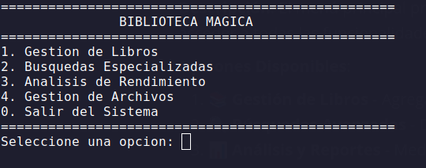

**Descripción**: El menú principal presenta cinco opciones principales que permiten acceder a todas las funcionalidades del sistema.

**Opciones Disponibles**:

1. **📚 Gestión de Libros** - Agregar, eliminar y listar libros
2. **🔍 Búsquedas Avanzadas** - Diferentes tipos de búsqueda
3. **📊 Análisis y Reportes** - Medición de rendimiento y diagramas
4. **📁 Importación CSV** - Carga masiva de datos
5. **🚪 Salir** - Cerrar el programa

### Navegación

- Utilice los **números (1-5)** para seleccionar opciones
- Presione **Enter** para confirmar
- El sistema valida automáticamente las entradas
- Use **0** o **opciones de regreso** para volver al menú anterior

---

## 📚 Gestión de Libros

### Acceso al Submenu de Gestión

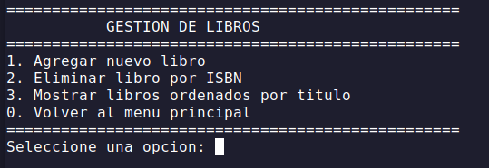

**Selección opción 1** del menú principal muestra el submenú de gestión con cuatro opciones:

1. **Agregar nuevo libro**
2. **Eliminar libro existente**
3. **Listar todos los libros**
4. **Regresar al menú principal**

### Agregar Nuevo Libro

#### Validaciones del Sistema

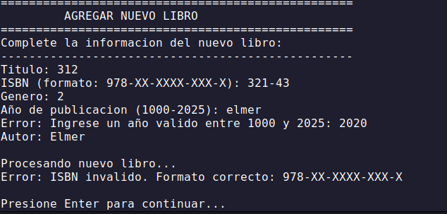

**Características de Validación**:

- **Formato ISBN**: Debe seguir el patrón XXX-X-XX-XXXXXX-X
- **Año de Publicación**: Debe estar entre 1000 y 2025
- **Campos Obligatorios**: Todos los campos deben ser completados
- **Mensajes de Error**: El sistema indica claramente cualquier error de formato

#### Proceso de Adición Exitosa

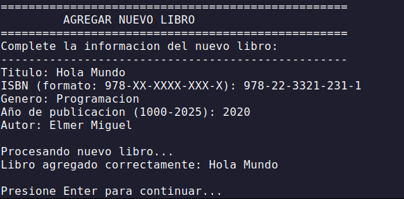

**Pasos para Agregar un Libro**:

1. **Título**: Ingrese el título completo del libro
2. **ISBN**: Formato válido (978-X-XX-XXXXXX-X)
3. **Género**: Categoría literaria del libro
4. **Año**: Año de publicación (validado automáticamente)
5. **Autor**: Nombre completo del autor

**Confirmación**: El sistema muestra un mensaje de éxito al agregar correctamente el libro.

### Eliminar Libro Existente

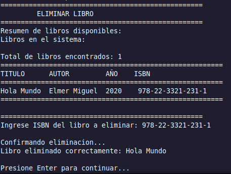

**Proceso de Eliminación**:

1. El sistema **lista todos los libros** disponibles
2. Muestra **ISBN, título y autor** de cada libro
3. Solicita el **ISBN del libro a eliminar**
4. **Confirma la eliminación** antes de proceder
5. Actualiza todas las estructuras de datos automáticamente

### Listar Todos los Libros

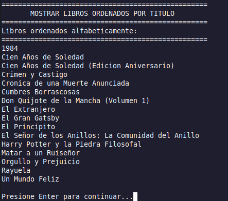

**Características del Listado**:

- **Ordenamiento Alfabético**: Por título del libro
- **Información Completa**: ISBN, título, autor, género y año
- **Formato Organizado**: Fácil lectura y navegación
- **Numeración**: Para facilitar la referencia

---

## 🔍 Sistema de Búsquedas

### Acceso al Menú de Búsquedas

**Selección opción 2** del menú principal accede al sistema de búsquedas avanzadas.

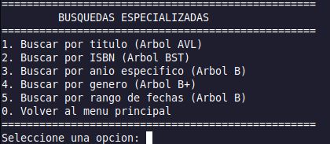

**Opciones de Búsqueda Disponibles**:

1. **🔤 Búsqueda por Título**
2. **📖 Búsqueda por ISBN**
3. **📅 Búsqueda por Año**
4. **🎭 Búsqueda por Género**
5. **📊 Búsqueda por Rango de Años**
6. **🔙 Regresar al Menú Principal**

### Resultados de Búsqueda

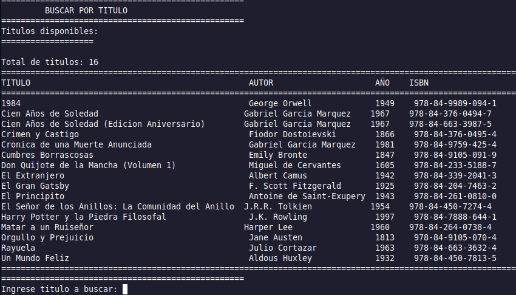

**Formato de Resultados**:

- **Información Completa**: Todos los datos del libro encontrado
- **Múltiples Resultados**: Si hay varios libros que coinciden
- **Mensaje Informativo**: Indica el tipo de búsqueda realizada

### Búsqueda por Título

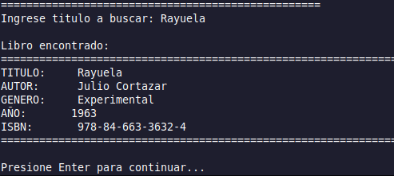

**Proceso**:

1. Seleccionar **opción 1** del submenú de búsquedas
2. **Ingresar el título** exacto o parcial del libro
3. El sistema muestra **todos los libros** que coinciden
4. **Información detallada** de cada resultado encontrado

### Búsqueda por ISBN

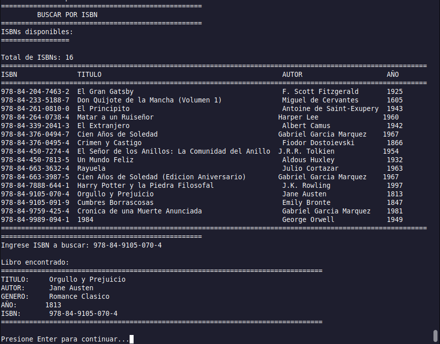

**Características**:

- **Búsqueda Exacta**: El ISBN debe coincidir completamente
- **Resultado Único**: Cada ISBN identifica un solo libro
- **Validación Automática**: Verifica formato del ISBN ingresado

### Búsqueda por Año

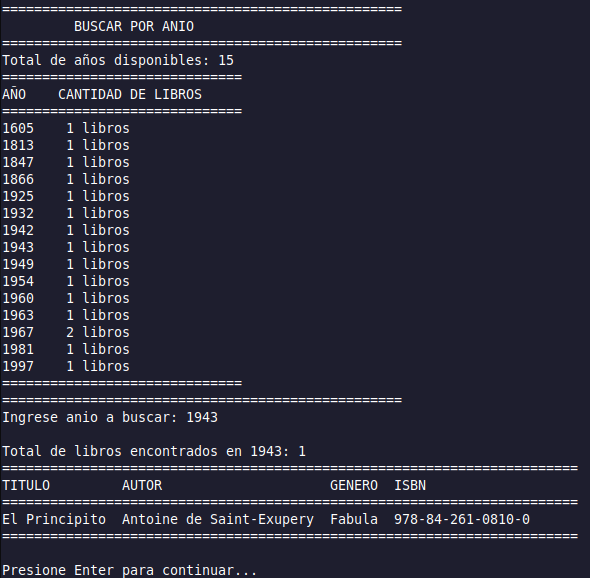

**Funcionalidad**:

- **Año Específico**: Encuentra todos los libros de un año determinado
- **Múltiples Resultados**: Muestra todos los libros del año seleccionado
- **Validación de Rango**: Verifica que el año esté en rango válido (1000-2025)

### Búsqueda por Género

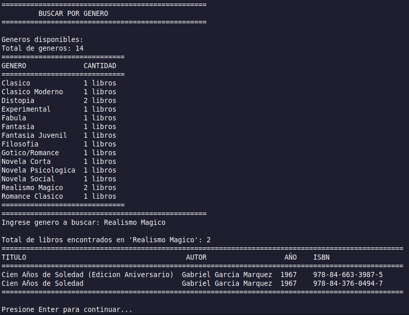

**Opciones**:

- **Categorías Literarias**: Novela, Ciencia Ficción, Historia, etc.
- **Búsqueda Flexible**: No diferencia mayúsculas/minúsculas
- **Resultados Agrupados**: Todos los libros del género seleccionado

### Búsqueda por Rango de Años


**Parámetros**:

- **Año Inicial**: Límite inferior del rango
- **Año Final**: Límite superior del rango
- **Validación**: Verifica que el rango sea lógico (inicio ≤ final)
- **Resultados Ordenados**: Por año de publicación

---

## 📊 Análisis y Reportes

### Acceso al Menú de Análisis

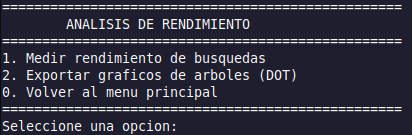

**Selección opción 3** del menú principal presenta tres opciones:

1. **⏱️ Medición de Rendimiento**
2. **🎨 Generación de Diagramas**
3. **🔙 Regresar al Menú Principal**

### Medición de Rendimiento

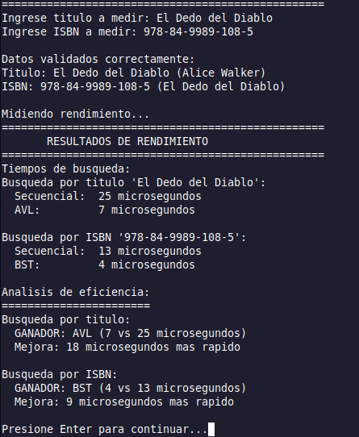

**Funcionalidades**:

- **Comparación entre Estructuras**: BST, AVL, Árbol B, Árbol B+, Lista
- **Tipos de Medición**:
  - Tiempo de búsqueda por título
  - Tiempo de búsqueda por ISBN
  - Tiempo de inserción
  - Tiempo de eliminación
- **Resultados en Tiempo Real**: Medición en milisegundos
- **Análisis Comparativo**: Tabla de resultados por estructura

### Generación de Diagramas

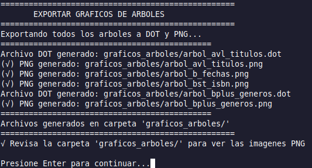

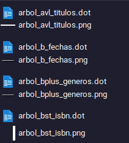

**Características**:

- **Archivos DOT**: Generación automática de código Graphviz
- **Imágenes PNG/SVG**: Conversión automática de diagramas
- **Ubicación de Archivos**: Carpeta específica indicada por el sistema
- **Estructuras Visualizadas**:
  - Árbol BST
  - Árbol AVL con factores de balance
  - Árbol B con nodos múltiples
  - Árbol B+ con enlaces horizontales

**Archivos Generados**:

```
graficos_arboles/
├── bst_diagram.dot
├── bst_diagram.png
├── avl_diagram.dot
├── avl_diagram.png
├── btree_diagram.dot
├── btree_diagram.png
├── bplus_diagram.dot
└── bplus_diagram.png
```

---

## 📁 Importación de Datos

### Carga de Archivos CSV

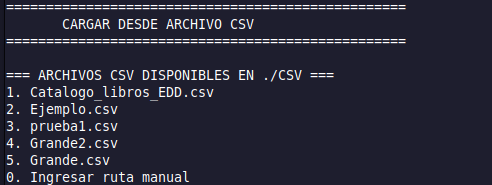

**Selección opción 4** del menú principal permite la importación masiva de datos.

**Opciones de Carga**:

1. **📂 Seleccionar archivo específico**
2. **📝 Ingresar ruta manualmente**
3. **🔙 Regresar al menú principal**

### Proceso de Importación

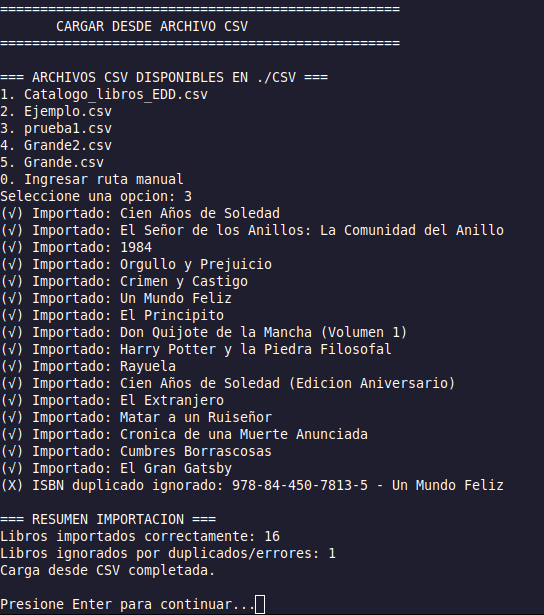

**Características del Proceso**:

- **Validación Automática**: Cada libro es validado antes de agregarse

- **Formato CSV Requerido**:
  
  ```csv
  titulo,isbn,autor,genero,anio
  "Ejemplo Título","978-0-12-345678-9","Autor Ejemplo","Género",2023
  ```

- **Manejo de Errores**: Libros con errores son omitidos con mensaje informativo

- **Progreso de Carga**: Indica cuántos libros se procesaron exitosamente

- **Actualización Automática**: Todas las estructuras se actualizan simultáneamente

### Formato de Archivo CSV

**Estructura Requerida**:

```csv
titulo,isbn,autor,genero,anio
"Don Quijote","978-0-12-345678-9","Miguel de Cervantes","Novela",1605
"Cien Años de Soledad","978-0-98-765432-1","Gabriel García Márquez","Realismo Mágico",1967
"1984","978-0-11-223344-5","George Orwell","Distopía",1949
```

**Reglas de Formato**:

- **Encabezados Obligatorios**: Primera línea debe contener los nombres de columnas
- **Comillas para Texto**: Títulos y nombres con comillas dobles
- **ISBN Válido**: Formato XXX-X-XX-XXXXXX-X
- **Año Numérico**: Entre 1000 y 2025
- **Codificación**: UTF-8 recomendada

---

## 🛠️ Solución de Problemas

### Errores Comunes

#### Error de Formato ISBN

**Síntoma**: "ISBN inválido" al agregar libro
**Solución**: 

- Verificar formato: XXX-X-XX-XXXXXX-X
- Ejemplo válido: 978-0-12-345678-9

#### Error de Año

**Síntoma**: "Año fuera de rango"
**Solución**: 

- Usar años entre 1000 y 2025
- Verificar que sea un número entero

#### Archivo CSV No Carga

**Síntoma**: "Error al leer archivo CSV"
**Soluciones**:

- Verificar que el archivo existe
- Comprobar permisos de lectura
- Validar formato de encabezados
- Usar codificación UTF-8

#### Programa No Inicia

**Síntoma**: Error al ejecutar
**Soluciones**:

- Verificar permisos de ejecución
- Comprobar compatibilidad del sistema
- Ejecutar desde terminal para ver errores detallados

### Mensajes del Sistema

| Mensaje                        | Significado                | Acción                 |
| ------------------------------ | -------------------------- | ---------------------- |
| "ISBN inválido"                | Formato incorrecto         | Usar XXX-X-XX-XXXXXX-X |
| "Año fuera de rango"           | Año no válido              | Usar 1000-2025         |
| "Libro ya existe"              | ISBN duplicado             | Verificar ISBN único   |
| "No se encontraron resultados" | Búsqueda sin coincidencias | Revisar criterios      |
| "Archivo no encontrado"        | CSV no localizado          | Verificar ruta         |

---

## ❓ Preguntas Frecuentes

### Funcionalidad General

**P: ¿Puedo tener libros con el mismo título?**
R: Sí, pero cada libro debe tener un ISBN único.

**P: ¿Hay límite en la cantidad de libros?**
R: No hay límite fijo, depende de la memoria disponible del sistema.

**P: ¿Se guardan los datos al cerrar el programa?**
R: El programa mantiene los datos durante la sesión. Para persistencia, use importación/exportación CSV.

### Búsquedas

**P: ¿Las búsquedas distinguen mayúsculas y minúsculas?**
R: No, las búsquedas son insensibles a mayúsculas/minúsculas.

**P: ¿Puedo buscar por parte del título?**
R: Sí, la búsqueda por título acepta coincidencias parciales.

### Importación de Datos

**P: ¿Qué pasa si mi CSV tiene errores?**
R: Los libros válidos se importarán, los con errores se omitirán con mensaje informativo.

**P: ¿Puedo importar el mismo archivo varias veces?**
R: Sí, pero los libros duplicados (mismo ISBN) se omitirán.

### Rendimiento

**P: ¿Qué estructura es más rápida?**
R: Depende de la operación. Use la función de medición de rendimiento para comparar.

**P: ¿Los diagramas afectan el rendimiento?**
R: No, se generan bajo demanda y no afectan las operaciones principales.

---

## 📞 Soporte Técnico

### Información de Contacto

- **Materia**: Estructuras de Datos SS2025
- **Proyecto**: Biblioteca Mágica v1.0
- **Documentación**: Ver Manual Técnico para detalles de implementación

### Reportar Problemas

Al reportar un problema, incluya:

1. **Sistema Operativo** y versión
2. **Descripción detallada** del error
3. **Pasos para reproducir** el problema
4. **Mensajes de error** exactos
5. **Archivos de prueba** si aplica

---

**¡Gracias por usar Biblioteca Mágica! 📚✨**

*Manual de Usuario v1.0*